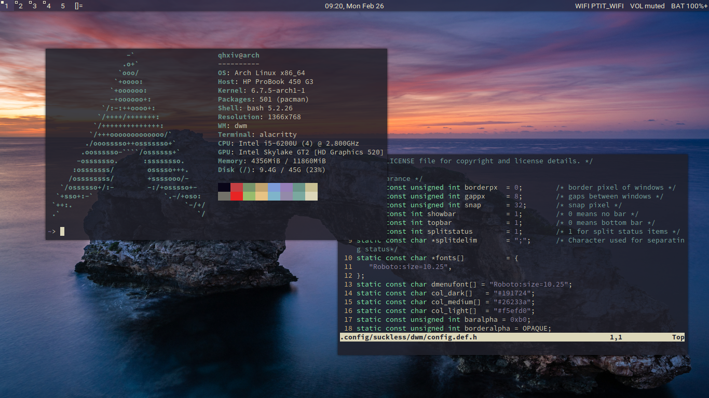

# My Arch Linux setup with dwm
- Statusbar: [my own script](https://github.com/qhxiv/dotfiles/tree/main/.scripts/statusbar) + splitstatus patch dwm
- Compositor: [picom](https://wiki.archlinux.org/title/picom)
- Image viewer: [feh](https://wiki.archlinux.org/title/Feh)
- Terminal font: Source Code Pro
- dwm font: Roboto
## Final look

